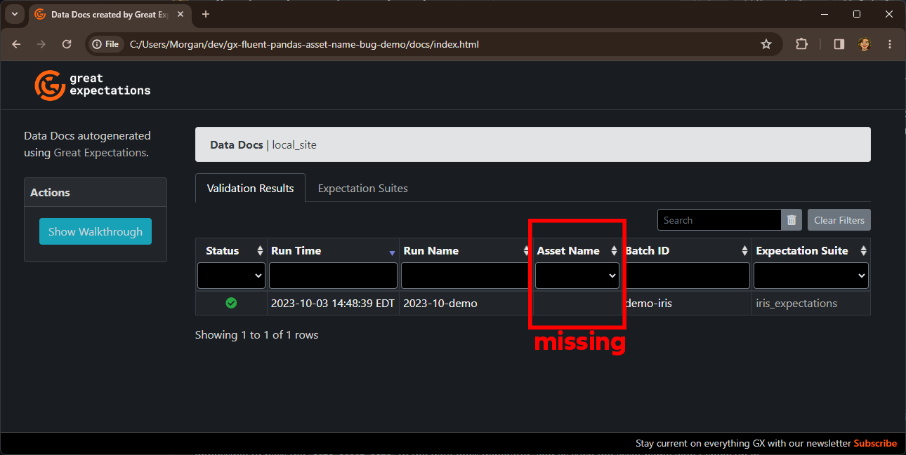

# GX Demo: Inability to Specify "Asset Name" for Fluent Datasources in Data Docs

This repo contains a minimal runnable example of how when using Fluent Pandas filesystem datasources in GX, it is impossible to pass the `data_asset_name` to the data docs generator, and as such the asset name won't show up in the results table.

## View the Output Online

The data docs output has been routed to the `docs/` folder in the root of this project and [can be viewed using GitHub Pages](https://morpahtic.github.io/gx-fluent-pandas-asset-name-bug-demo/).

## Reproduce Locally

To reproduce the issue locally:

1. Pre-requisites:
   1. Git
   2. Python v3.11+ (only tried with 3.11)
   3. [Poetry](https://python-poetry.org/docs/#installation)
2. Clone this repo
3. `cd` into the root of the project and run `poetry install` 
   This will create a `.venv` folder and install all dependencies into it.
4. Activate your environment with one of:
   1. `poetry shell` (recommended)
   2. `source .venv/bin/activate` (Linux/Mac) or
   3. `source .venv/Scripts/activate` (Windows)
5. To see existing data docs, open `docs/index.html` in your browser
6. To do a new validation run, `python main.py`

Here is a screenshot of the output:

## Credits

This project uses the [Iris dataset from UC Irvine Machine Learning Repository](https://archive.ics.uci.edu/ml/datasets/iris).
